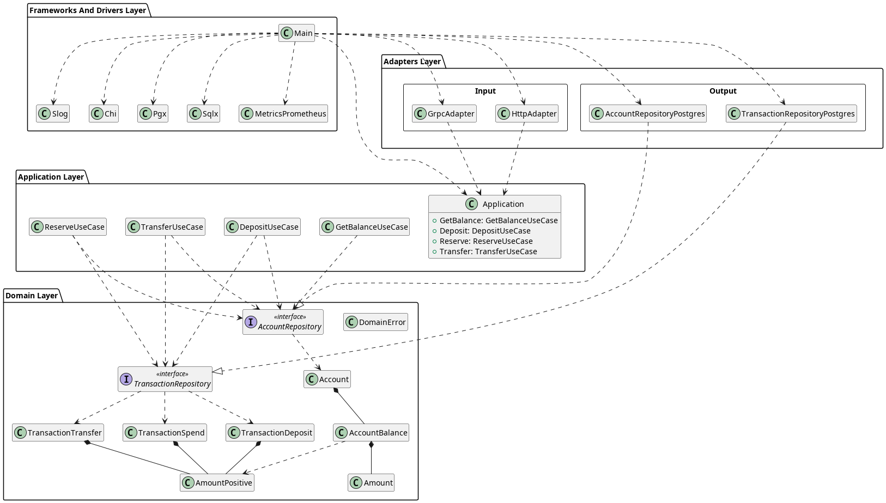

# Avito Internship Task 1

Реализация тестового задания на позицию стажера-бэкендера В авито
https://github.com/avito-tech/internship_backend_2022

[TOC]

## О реализации

- реализованы все требования
- слоистая архитектура
- покрытие тестами 70%
- доменная логика реализована в технике DDD
- GRPC сервер
- cli инструмент
- метрики для prometheus
- трассировка opentrace
- структурное логирование 
- сборщик логов grafana/loki
- интеграционные тесты через dockertest
- утилита для бенчмарка

Что лучше было бы сделать иначе:
- openapi спецификация генерируется при помощи swaggo из аннотаций. Лучше было бы генерировать сервер и клиент из спецификации, а не наоборот.

## Использование

```bash
make cover

make cover-html
```

## Архитектура

Упрощенная диаграмма архитектуры:



Более детальная диаграмма архитектуры: [doc/diagram.png](doc/diagram.png)

Использована слоистая гексагональная архитектура из четырех слоев:

- доменная логика
- приложение
- адаптеры
- инфраструктура

### Cлой доменной логики (domain)

* [/internal/balance/domain](/internal/balance/domain)

Ядром архитектуры является доменная логика, выполненная в технике DDD. Для надежности все доменные типы создаются при помощи конструкторов, которые проверяют соотвествие значений бизнес-правилам. Например: баланс пользователя не может быть отрицательным, и для него введен отдельный тип `Amount`, значение которого является приватным и доступно для инициации лишь в рамках доменной логики, а его изменение только через методы, проверяющие валидность диапазона значений [0..math.MaxInt64]. 

```go
// Неотрициательное кол-во копеек
type Amount struct {
	amount int64
}

func (a Amount) Add(b AmountPositive) (Amount, error) {
    // ...
}

func (a Amount) Sub(b AmountPositive) (Amount, error) {
    // ...
}
```

Баланс пользователя представлен value-object типом `AccountBalance`, для которого также реализован ряд методов, реализующих перемещение средств между доступным и резервированным балансами, и возвращающих доменную ошибку при попытке некорректной операции.

```go
type AccountBalance struct {
    available amount.Amount
	reserved  amount.Amount
}

func (ac AccountBalance) Deposit(a amount.AmountPositive) (AccountBalance, error) {
    // ...
}
func (ac AccountBalance) Reserve(a amount.AmountPositive) (AccountBalance, error) {
    // ...
}
func (ac AccountBalance) Withdraw(a amount.AmountPositive) (AccountBalance, error) {
    // ...
}
// ...
```

Баланс пользователя является частью сущности Account, для которой описаны методы, изменяющие её состояние через pointer receiver, и соответствующие требуемым юзкейсам: Deposit, Reserve, ReserveCancel, ReserveConfirm, Transfer.

Транзакции представлены тремя сущностями: TransactionDeposit - зачисление на счет, TransactionSpend  - оплата продукта, и TransactionTransfer - перевод между пользователями. Статус операции оплаты продукта определяется наличием транзакции Spend со статусом, отличным от `canceled`: `reserved`, если деньги зарезервированы; `confirmed`, если продукт оплачен. 

В доменной зоне также описаны интерфейсы репозиториев для каждой из сущностей: Account и Transactions.

#### Ошибки слоя

Данный слой возвращает предзаданные ошибки отдельного типа `DomainError`

```go 
type DomainError struct {
	message string
}

// Скрывает cause из Error(). Причина остается доступна через errors.Cause(err).
// Обе ошибки (DomainError и cause) матчатся через errors.Is
// Позволяет добавить дополнительную информацию для логирования
func (e DomainError) WithCause(cause error) error {
	// ...
}

func IsDomainError(err error) bool {
	var de DomainError
	return errors.As(err, &de)
}

var (
	ErrInvalidAmount         = domainError.New("invalid amount")
	ErrInvalidPositiveAmount = domainError.New("invalid positive amount")
	ErrInsufficientAmount    = domainError.New("insufficient amount")
	ErrIntegerOverflow       = domainError.New("integer overflow")
    // и тд
)
```

### Слой приложения (application)

* [/internal/balance/app](/internal/balance/app)
* [/internal/balance/app_impl](/internal/balance/app_impl)

В этом слое реализованы сценарии использования (use-cases). Сценарий должен реализовывать один из двух интерфейсов:

```go
// сценарий не возвращает результат, например Deposit
type UseCase0[In any] interface {
	Handle(ctx context.Context, in In) error
    // имя сценария используется для логирования, метрик и для разграничения прав 
    // доступа пользователей микросервиса
	GetName() string
}

// сценарий возвращает результат, например GetBalance
type UseCase1[In any, Out any] interface {
	Handle(ctx context.Context, in In) (Out, error)
	GetName() string
}
```

Сценарий характеризуется набором зависимостей, которые передаются конструктору `New`, типом запроса `In` и опциональным типом результата `Out`. 

In-типы объявлены структурами с приватными полями доменных типов. Для их создания пользователь сценария должен вызывать конструктор `NewInFromValues`, внутри которого входящие значения проверятся на соотвествие бизнес-правилам. Таким образом в use-case попадут только валидированные значения, не нарушающие логику.

```go
type In struct {
	userID domain.UserID
}

func NewInFromValues(userID int64) (In, error) {
	_userID, err := domain.NewUserID(userID)
	if err != nil {
		return In{}, err
	}
	return In{userID: _userID}, nil
}
```

Так как сценарию может потребоваться изменение как баланса пользователя, так и списка его транзакций, необходимо предусмотреть атомарность изменения в двух репозиториях. Для этого применятся библиотека [go-transaction-manager](github.com/avito-tech/go-transaction-manager), которая позволяет сделать это при помощи высокоуровненего стабильного API, сохраняющего слой приложения от низкоуровневых деталей реализации репозиториев. 

Для этого сценарию, использующему репозиторий передается в качестве зависимостей объект типа `trm.Manager`

```go
// Manager manages a transaction from Begin to Commit or Rollback.
type Manager interface {
	// Do processes a transaction inside a closure.
	Do(context.Context, func(ctx context.Context) error) error
	// DoWithSettings processes a transaction inside a closure with custom trm.Settings.
	DoWithSettings(context.Context, Settings, func(ctx context.Context) error) error
}
```

Это также позволит использвать данный сценарий в других сценариях в рамках одной транзакции ([Статья на хабре](https://habr.com/ru/companies/avito/articles/727168/)), если это понадобится.

#### Декораторы use-case

* [internal/common/decorator](internal/common/decorator)

То, что все сценарии использования реализуют единый интрефейс, позволяет добавить в архитектуру слоя приложения такую функцию, как декораторы, которые по функциональности представляют собой аналог middleware в других областях.

Например, декоратор логирования:

```go
type Decorator0Logging[T any] struct {
	base   UseCase0Handler[T]
	logger logging.Logger
}

func (d *Decorator0Logging[T]) Handle(ctx context.Context, in T) (err error) {
	defer func() {
		if err != nil {
			d.logger.Error(d.base.GetName(), "use_case", d.base.GetName(), "error", err)
		}
	}()
	d.logger.Info(d.base.GetName(), "use_case", d.base.GetName())
	return d.base.Handle(ctx, in)
}
```

В данном микросервисе реализованы декораторы: логирование, метрики, panic-recover.

Тип, представляющий собой application-слой микросервиса:

```go
// Application это интерфейс приложения со всеми используемыми в приложении use case
type Application struct {
	// Auth
	AuthSignin        UseCase1[auth_signin.In, auth_signin.Out]
	AuthSignup        UseCase0[auth_signup.In]
	AuthValidateToken UseCase1[auth_validate_token.In, auth_validate_token.Out]
	// Balance
	GetBalance          UseCase1[get_balance.In, get_balance.Out]
	Deposit             UseCase0[deposit.In]
	Reserve             UseCase0[reserve.In]
	ReserveCancel       UseCase0[reserve_cancel.In]
	ReserveConfirm      UseCase0[reserve_confirm.In]
	Transfer            UseCase0[transfer.In]
	ReportTransactions  UseCase1[report_transactions.In, report_transactions.Out]
	ReportRevenue       UseCase1[report_revenue.In, report_revenue.Out]
	ReportRevenueExport UseCase1[report_revenue_export.In, report_revenue_export.Out]
}
```

Этот тип, хотя и реализуется, как структура, по своей сути является интерфейсом слоя application и не несет конкретных имплементаций сценариев. Этот тип используют input-адаптеры для работы с приложением, за счет чего: 

1. их проще тестировать, подменяя реализацию на мок (см [internal/balance/tests/mocked/app.go](internal/balance/tests/mocked/app.go)) 
2. появляется возможность расширять поведение сценариев за счет декораторов.

Реализация этого интерфейса конструируется на уровне инфраструктуры в [internal/balance/app_impl](internal/balance/app_impl/app_impl.go), где имплементации сценариев инстанциируются с завимостями и оборачиваются в необходимые декораторы.

Также на уровне приложения определены права доступа ролей пользователей микросервиса к сценариям [internal/balance/app/roles/roles.go](internal/balance/app/roles/roles.go). Эти права проверяются в input-адаптерах после проверки аутентификационного токена.

#### Ошибки слоя

Множество ошибок слоя, то есть то, что может вернуть метод Handle, представлено:

- Ошибки доменного слоя - DomainError.
- Ошибки самого слоя application - UseCaseError. Их иплементация повторяет DomainError.
- Ошибки репозиториев и прочих зависимостей, возвращаемые обернутыми через errors.Wrap в дополнительный контекст.

### Адаптеры

* [internal/balance/adapters](internal/balance/adapters)

Слой делится на input и output адаптеры. Первые обрабатывают входящие к микросервису запросы, трансформируя их в In-типы сценариев, вызывают сценарии и формируют ответ, трансформируя результат или ошибку работы сценария в соотвествующий адаптеру результат. К ним относятся http, grpc и cli-адаптеры. Output-адаптеры, в свою очередь, являются прослойкой для исходящих из сценариев во внешний мир запросов. В данном микросервисе это имплементации репозиториев, выполняющие запросы к базе данных.

#### Репозитории

* [internal/balance/adapters/repositories](internal/balance/adapters/repositories)

Репозитории реализуют интерфейсы, объявленные в слое доменной логики. 

```go
var _ domainAccount.AccountRepository = (*AccountsRepository)(nil)
```

В их зависимостях соединение с базой данных, обернутое в библиотеку sqlx для упрощения сериализации объектов на запись и чтение из БД, и геттер текущей sqlx-транзакции библиотеки go-transaction-manager для кросс-репозиторных транзакций. Доменные сущности сериализуются в базу и обратно через DTO структуры, использование которых позволяет оградить доменную область от деталей репозиториев. Трансформация из DTO в сущности проводится посредством конструкторов из доменного слоя, что позволяет провести валидацию соотвествия доменной логике данных из базы данных.

```go
type accountDTO struct {
	Id               int64 `db:"id"`
	UserId           int64 `db:"user_id"`
	BalanceAvailable int64 `db:"balance_available"`
	BalanceReserved  int64 `db:"balance_reserved"`
}

func fromAccountDTO(a *accountDTO) (*domainAccount.Account, error) {
	acc, err := domainAccount.NewAccountFromValues(
		a.Id,
		a.UserId,
		a.BalanceAvailable,
		a.BalanceReserved,
	)
	if err != nil {
		return nil, domainError.Strip(err)
	}
	return acc, nil
}

func toAccountDTO(a *domainAccount.Account) *accountDTO {
	return &accountDTO{
		Id:               a.ID.Value(),
		UserId:           a.UserID.Value(),
		BalanceAvailable: a.Balance.GetAvailable().Value(),
		BalanceReserved:  a.Balance.GetReserved().Value(),
	}
}
```

Как можно заметить, доменная ошибка пропускается через domainError.Strip. Это функция превращает доменную ошибку в обычную. Это сделано потому, что подобная ошибка сигнализирует о нарушении данных адаптера и является ошибкой адаптера, а не домена (например, забыли провести миграцию БД). Доменные ошибки демонстрируются пользователю микросервиса, в то время как ошибка консистентности базы данных это Internal Error, которая логируется, но не демонстрируется пользователю.

Все SELECT-запросы внутри репозиториев, которые могут быть использованы для модификации данных счета, вызываются с блокировкой `FOR UPDATE` для того, чтобы избежать data race при работе с данными счета в базе данных.

Три типа транзакций представлены тремя отдельными таблицами. Для получения списка транзакции отдельного счета используется UNION ALL запрос В CTE ([transactions_pg/report_transactions.go](internal/balance/adapters/repositories/transactions_pg/report_transactions.go)), результат которого сортируется и паджинируется посредством составного курсора (amount+id или updated_at+id). Hash-индексы по user_id, account_id позволяет эффективным образом выбрать транзакции отдельного счета.

##### Timezone

Микросервис возвращает время в UTC. При запуске проверяется, что часовой пояс Postgres установлен в UTC. Схема таблиц postgres использует тип TIMESTAMPTZ для хранения времени. Также на уровне инфраструктуры соединению с postgres прописано расширение ([pkg/sqlx_pg/timezone.go](pkg/sqlx_pg/timezone.go)), которое автоматически устанавливает возвращаемое драйвером время в UTC. Таким образом, сохраняемое в базу локальное время сохраняется и возвращается из базы в UTC, при этом сохраняемое время == полученное из базы время. Смотри тест [internal/balance/tests/postgres/postgres_test.go](internal/balance/tests/postgres/postgres_test.go). 

<!-- > Хотя сохраняемое и полученное из базы время будут проходить тест через Equal, так как golang учитывает часовые пояса двух времен при сравнении, нельзя сравнивать отдельные элементы времени, например, час или день, так как они не будут совпадать.
> ```go
> func (s *Suite) TestEqaultDates() {
>	t0 := time.Date(2025, 12, 31, 0, 0, 0, 0, time.Local)
>	t1 := t0.UTC()
>
>	require.True(s.T(), t0.Equal(t1))
>	require.NotEqual(s.T(), t0.Day(), t1.Day())
>}
>```` -->

##### Ошибки репозиториев

Репозитории должны возвращать ошибки домена, когда это прописано в контракте интерфейса репозитория. Например, трансформируя sql.ErrNoRows в ErrAccountNotFound, когда запись об аккаунте не найдена в БД. Также репозитории могут возвращать ошибки из слоя application, когда реализуют интерфейс, описанный в этом слое. Например, `ErrSortingCursorInvalid`, когда репозиторию передан курсор, который он не может распарсить.

Прочие ошибки должны возвращаться обернутые в контекст, однозначно указывающий на место их возникновения.

```go
func (r *AccountsRepository) update(ctx context.Context, tr trmsqlx.Tr, accDto *accountDTO) (*accountDTO, error) {
    // ...
	err = tr.GetContext(ctx, &newDTO, sq, args...)
	if errors.Is(err, sql.ErrNoRows) {
		return nil, domainAccount.ErrAccountNotFound
	}
	if err != nil {
		return nil, errors.Wrap(err, "AccountsRepository.update.GetContext")
	}
    // ...
}
```

#### HTTP-адаптер

* [internal/balance/adapters/http/http.go](internal/balance/adapters/http/http.go)

HTTP-адаптер экспортирует интерфейс, повторяющий интерфейс слоя приложения Application, но вместо UseCase предоставляются типы http.Handler, которые позволяют адаптировать использование use-case под HTTP-протокол. На уровне инфрастуктуры этот интерфейс будет интегрирован в конкретную реализацию http-сервера.

```go
type Handler interface {
	GetHandler() http.Handler
}

type HttpAdapter struct {
	GetBalance          Handler
	Deposit             Handler
	Reserve             Handler
	// ...
}
```

Также этот адаптер экспортирует [роутинг](internal/balance/adapters/http/router/router.go), который прописывает переданному http-роутеру соответствие путь+метод -> handler. На данном этапе http-адаптер остается независимым от используемой реализации роутера (chi, mux, echo).

При реализации адаптера отдельного use-case в http-хэндлер, я не удержался от того, чтобы использовать свою библиотеку [go-ergo-handler](https://github.com/nktknshn/go-ergo-handler), которая позволяет создание http-хэндлеров в [лаконичном декларативном и типобезопасном виде](internal/balance/adapters/http/handlers/report_transactions/report_transactions.go). Минус такого подхода (ручное конструирование хэндлеров) в том, что приходится поддерживать аннотации для генерации openapi-спефицикации в актуальном виде, и ничто не предохраняет от вероятности забыть обновить аннотации. Лучшим подходом я считаю ручное написание спецификации, из которой уже генерируются хэндлеры. При таком подходе остается единый источник истины (Single source of truth) - спецификация.


##### Аутентификация и авторизация

Отдельный http-хэнделер обычно использует две зависимости: use-case, который он адаптирует, и use-case, отвечающий за проверку токена аутентификации. В реализации данного микросервиса аутентификация и авторизация реализованы не в виде общего для всех middleware, а как составная часть каждого хэндлера. 

```go

func makeDepositHandler(auth handlers_auth.AuthUseCase, u useCase) http.Handler {
	var (
        // добавлят парсер, который проверит токен из http-заголовка 
        // и прописанную роль в нем на соответствие допустимым ролям 
        // для данного use-case
		b, _    = handlers_builder.NewWithAuthForUseCase(auth, u.GetName())
        // распарсит payload
		payload = ergo.PayloadAttach[requestBody](b)
	)
    // ...
```

С одной стороны это повышает надежность (не получится забыть прописать аутентификацию хэндлеру), повышает гибкость настройки аутентификации отдельного хэндлера (разграничение доступа по ролям пользователя), с другой стороны увеличивает связность кода, немного усложняя тестирование хэндлера и снижая реюзабельность его частей (нельзя использовать хэндлер без аутентификации, а аутентификации привязана к конкретной библиотеке (моей), которая на данный момент не позволяет использовать свой парсер как стандартный http-middleware).

##### Обработка ошибок

* [internal/balance/adapters/http/handlers/handlers_builder/handler_error_func.go](internal/balance/adapters/http/handlers/handlers_builder/handler_error_func.go)

Соблюдается такое правило: доменные (DomainError) ошибки и ошибки слоя use-case (UseCaseError) передаются как есть (с внутренним сообщением) пользователю микросервиса со статусом BadRequest, ошибки валидации данных запроса возвращаются со статусом BadRequest, прочие ошибки возвращаются со статусом InternalServerError и сообщением "internal server error", скрывая детали ошибки от пользователя. Некоторые доменные ошибки, например ErrAccountNotFound оборачиваются в соотвествующий статус-код, например 404.

Ошибка трансформируется в json `{"error": "error message"}`, успешный результат в `{"result":{...}}`


#### GRPC-адаптер

* [internal/balance/adapters/grpc](internal/balance/adapters/grpc)
* [internal/common/genproto/balance/balance_grpc.pb.go](internal/common/genproto/balance/balance_grpc.pb.go)

GRPC-адаптер представляет собой реализацию интерфейса, сгенерированного из protobuf спецификации. Помимо требуемых методов он предоставляет метод, возвращающий интерцептор для аутентификации пользователя.

```go
func (g GrpcAdapter) UnaryServerInterceptor() grpc.UnaryServerInterceptor {
	return auth.NewAuthInterceptor(
		g.app.AuthValidateToken,
		methodToRoles(),
	).Unary()
}
```

Данный интерцептор извлекает заголовок `authorization` из метаданных запроса и проверяет его через use-case `g.app.AuthValidateToken`. Если токен валиден, то из его данных извлекается роль пользователя, которому был выдан токен, которая проверяется по словарю grpc-метод->список ролей, который возвращается функцией `methodToRoles()`. Дополнительно в функции [init при помощи рефлексии проверяется](internal/balance/adapters/grpc/roles.go), что все методы GRPC-адаптера имеют соответствие в списке ролей, сигнализируя о забытых прописанных методу ролях при запуске микросервиса, а не во время обработки запроса.

#### Обработка ошибок

Статусы ошибок: codes.InvalidArgument при ошибке конструированя In-типа сценария, codes.Internal при прочих ошибках. 

>TODO: лучше было бы унифицировать обработку ошибок в слое адаптеров из слоя application для адаптеров посредством функций ErrorToHttpError, ErrorToGRPCError

#### Cli-адаптер

Данный адаптер позволяет использовать приложение из командной строки. Он предоставляет доступ к юзкейсам регистрации нового пользователя с ролью и получения для него токена.

```go
func (a *CliAdapter) SignUp(ctx context.Context, username string, password string, role string) error {
	in, err := auth_signup.NewInFromValues(username, password, role)
	if err != nil {
		return err
	}
	err = a.app.AuthSignup.Handle(ctx, in)
	if err != nil {
		return err
	}
	return nil
}
```

Слой использует библиотеку cobra для удобной реализации клиента. Дополнительно слоя абстракции решено было не делать.

### Common

* [internal/common](internal/common)

Здесь описаны интерфейсы зависимостей и вспомогательные инструменты и типы.

- [internal/common/token_generator](internal/common/token_generator) интерфейсы генератора и валидатора токена
- [internal/common/password_hasher](internal/common/password_hasher) интерфейс хэшера и валидатора хэша паролей
- [internal/common/decorator](internal/common/decorator) декораторы use-case
- [internal/common/logging](internal/common/logging) интерфейс логгера
- [internal/common/metrics](internal/common/metrics) интерфейс метрик


### Слой инфрастуктуры

* [internal/balance/cmd](internal/balance/cmd)
* [internal/balance/app_impl](internal/balance/app_impl)

В данном слое читается конфиг, инициализируются все имплементации зависимостей, создается соединение с базой, инстанциируется реализация слоя application, из которой инициализируются адаптеры.

#### pkg

* [pkg](pkg)

Здесь хранятся реализации инфраструктурных зависимостей, используемых приложением через абстрактные интерфейсы. Каждый подпакет реализует конкретную технологию или интеграцию, необходимую для работы микросервиса. Это позволяет легко подменять реализации (например, для тестирования или смены технологии) и изолировать бизнес-логику от деталей реализации.

В пакете представлены следующие реализации:

- [pkg/token_generator_jwt](pkg/token_generator_jwt/) — генерация и валидация JWT-токенов для аутентификации.
- [pkg/password_hasher_argon](pkg/password_hasher_argon/) — хэширование паролей с помощью Argon2.
- [pkg/testing_pg](pkg/testing_pg/) — инструменты для тестирования с PostgreSQL.
- [pkg/config_cleanenv](pkg/config_cleanenv/) — работа с конфигурацией через cleanenv.
- [pkg/sqlx_pg](pkg/sqlx_pg/) — работа с PostgreSQL через sqlx.
- [pkg/metrics_prometheus](pkg/metrics_prometheus/) — интеграция с Prometheus для сбора метрик.

### Логирование

### Тестирование

* [internal/balance/tests](internal/balance/tests)

Большинство тестов содержатся отдельно от тестируемого кода внутри пакета [internal/balance/tests](internal/balance/tests). 

Репозитории и use-case тестируются в комплекте с базой данных посредством dockertest. Для тестирование с докером реализовано [расширение библиотеки testify/suite](pkg/testing_pg/suite.go), которое позволяет легко развернуть тестовую среду.

Адаптеры тестируются с моками юзкейсов.

Доменная логика тестируется юнит-тестами в том же пакете, где прописана.

## Использованные инструменты

- [go-transaction-manager](github.com/avito-tech/go-transaction-manager) для кросс-репозиторных транзакций
- [chi]()
- [sqlx](https://github.com/jmoiron/sqlx) обертка для упрощения работы с базой данных
- [pgx](https://github.com/jackc/pgx) для работы с базой данных
- [cobra](https://github.com/spf13/cobra) для cli инструмента
- [swaggo](https://github.com/swaggo/swag) генерация openapi спецификации из аннотаций
- [openapitools/openapi-generator](https://github.com/openapitools/openapi-generator) генерация http-клиента для утилиты бенчмарка
- [go-ergo-handler](https://github.com/nktknshn/go-ergo-handler) для создания http-хэндлеров
- [testify](https://github.com/stretchr/testify) для тестирования
- [golangci-lint](https://github.com/golangci/golangci-lint) для линтинга
- [nilaway](https://github.com/go-uber/nilaway) линтер для отслеживания nil-значений
- [dockertest](https://github.com/ory/dockertest) интеграционные тесты с базой данных
- [reflex](https://github.com/cespare/reflex) для перекомпиляции приложения при изменении кода
- [docker](https://www.docker.com/) Docker
- [prometheus](https://prometheus.io/) для сбора метрик
<!-- - [opentracing](https://opentracing.io/) для трассировки -->
- [grafana](https://grafana.com/) для визуализации метрик и логов
- [loki](https://grafana.com/oss/loki/) для сбора логов
- [promtail](https://grafana.com/oss/loki/) для сбора логов
