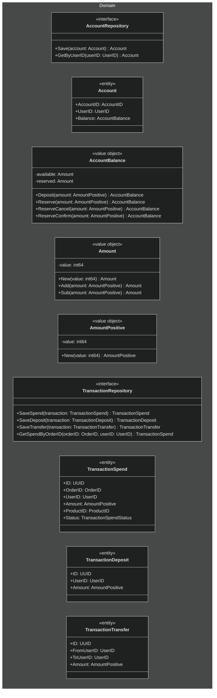
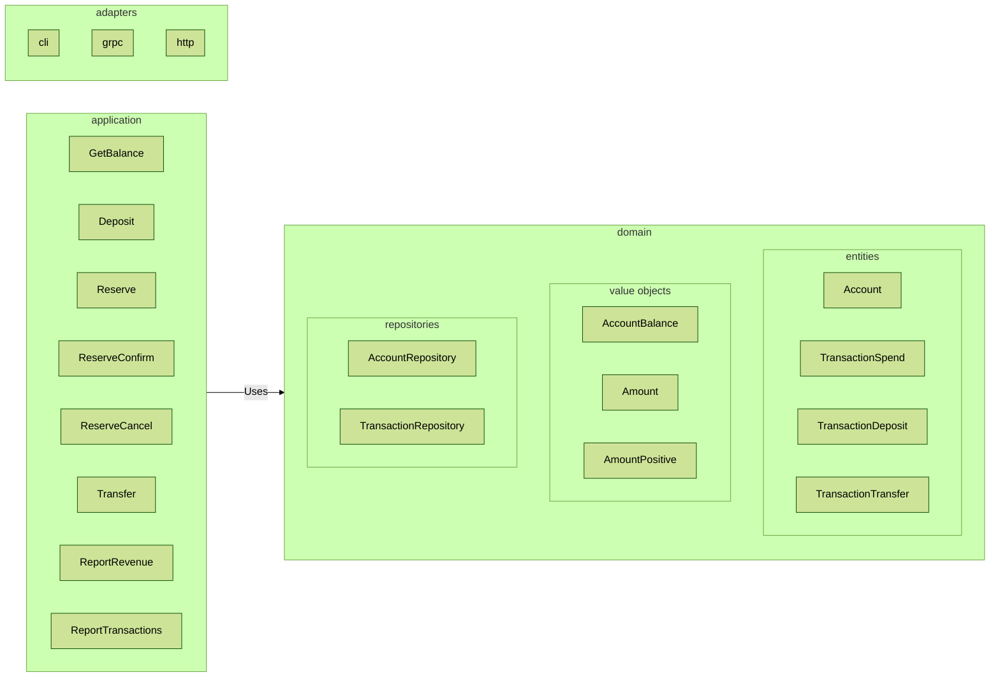

# Диаграмма

```mermaid
---
config:
    class:
      hideEmptyMembersBox: true
---
classDiagram
    %%{init: {'theme':'dark'}}%%
    namespace Domain {
        class AccountRepository {
            <<interface>>
            +Save(account: Account) Account
            +GetByUserID(userID: UserID) Account
        }

        class Account {
            <<entity>>
            +AccountID: AccountID
            +UserID: UserID
            +Balance: AccountBalance
        }

        class AccountBalance {
            <<value object>>
            -available: Amount
            -reserved: Amount
            +Deposit(amount: AmountPositive) AccountBalance
            +Reserve(amount: AmountPositive) AccountBalance
            +ReserveCancel(amount: AmountPositive) AccountBalance
            +ReserveConfirm(amount: AmountPositive) AccountBalance
        }

        class Amount {
            <<value object>>
            -value: int64
            +New(value: int64) Amount
            +Add(amount: AmountPositive) Amount
            +Sub(amount: AmountPositive) Amount
        }

        class AmountPositive {
            <<value object>> 
            -value: int64
            +New(value: int64) AmountPositive
        }
        

        class TransactionRepository {
            <<interface>>
            +SaveSpend(transaction: TransactionSpend) TransactionSpend
            +SaveDeposit(transaction: TransactionDeposit) TransactionDeposit
            +SaveTransfer(transaction: TransactionTransfer) TransactionTransfer
            +GetSpendByOrderID(orderID: OrderID, userID: UserID) TransactionSpend
        }

        class TransactionSpend {
            <<entity>>
            +ID: UUID
            +OrderID: OrderID
            +UserID: UserID
            +Amount: AmountPositive
            +ProductID: ProductID
            +Status: TransactionSpendStatus
        }

        class TransactionDeposit {
            <<entity>>
            +ID: UUID
            +UserID: UserID
            +Amount: AmountPositive
        }

        class TransactionTransfer {
            <<entity>>
            +ID: UUID
            +FromUserID: UserID
            +ToUserID: UserID
            +Amount: AmountPositive
        }
        
    }
```

```mermaid
%%{init: {'theme':'forest'}}%%
flowchart LR
    subgraph "domain"
        subgraph "entities"
            Account
            TransactionSpend
            TransactionDeposit
            TransactionTransfer
        end
        subgraph "value objects" 
            AccountBalance
            Amount
            AmountPositive
        end
        subgraph "repositories"
            direction LR
            AccountRepository
            TransactionRepository
        end
    end

    subgraph "application"
        direction LR
        GetBalance
        Deposit
        Reserve
        ReserveConfirm
        ReserveCancel
        Transfer
        ReportRevenue
        ReportTransactions
    end

    subgraph "adapters"
        subgraph "repositories"
            AccountRepository
            TransactionRepository
        end
        
        subgraph "http"
            
        end
        
        subgraph "grpc"

        end

        subgraph "cli"

        end
    end


    application -->|Uses| domain
```